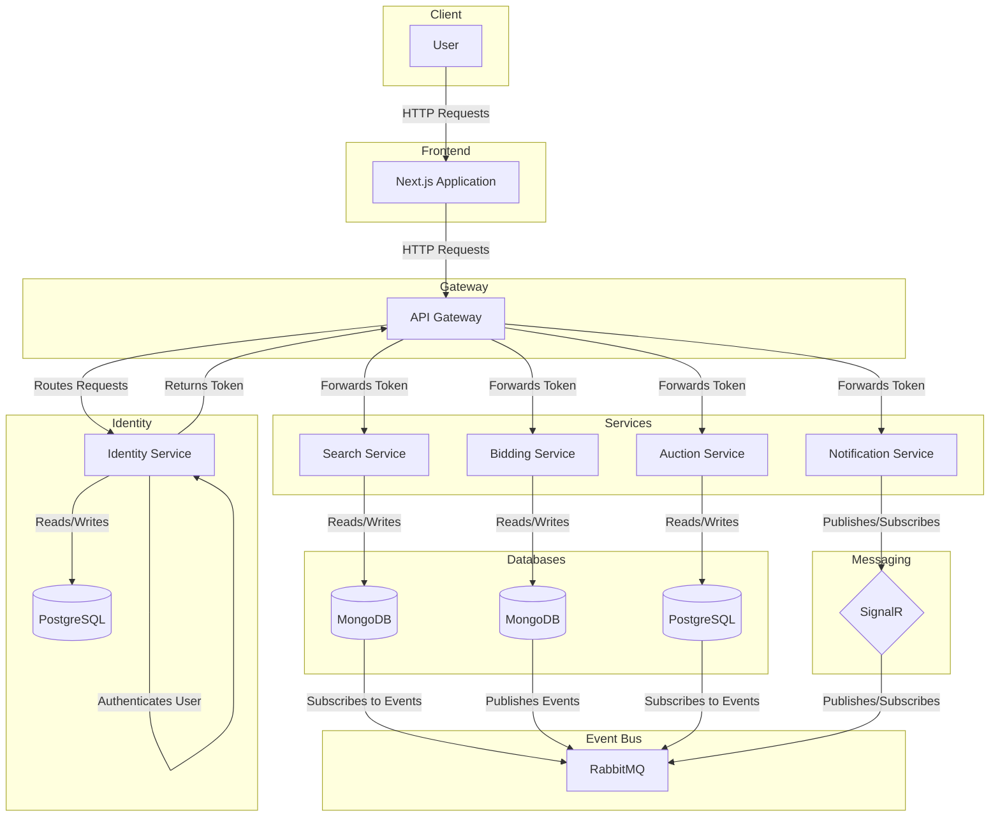

# Carsties

Carsties is a project that showcases a microservices-based architecture for a car auctioning platform. It leverages technologies such as .NET, Next.js, IdentityServer, RabbitMQ, Docker, and Kubernetes to demonstrate modern development practices.

## Features

- **Microservices Architecture**: Each service operates independently, promoting scalability and resilience.
- **Client Application**: Frontend developed with Next.js, providing a responsive user interface.
- **Service Communication**: Utilizes RabbitMQ for inter-service messaging and gRPC for efficient communication.
- **Identity Management**: Integrated with Duende IdentityServer for secure authentication and authorization.
- **Gateway**: Employs Microsoft YARP as a reverse proxy to route client requests to appropriate services.
- **Real-Time Updates**: Implements SignalR for push notifications to clients.
- **Testing**: Includes unit and integration tests using XUnit.
- **Containerization**: All services are Dockerized for consistent deployment across environments.
- **Orchestration**: Kubernetes manages service deployment, scaling, and maintenance.

## Architecture



The system comprises several microservices, each responsible for specific business capabilities:

- **Auction Service**: Manages car auctions, including creation, updates, and retrievals.
- **Search Service**: Provides search functionality across auctions.
- **Identity Service**: Handles user authentication and authorization.
- **Bidding Service**: Manages bids placed on car auctions.
- **Notification Service**: Sends notifications related to auctions and bids.
- **Gateway Service**: Acts as an API gateway, routing requests to appropriate services.

These services communicate through HTTP and messaging queues, ensuring decoupled and efficient interactions.

## Getting Started

### Prerequisites

Ensure you have the following installed:

- [.NET 9 SDK](https://dotnet.microsoft.com/download/dotnet/9.0)
- [Node.js](https://nodejs.org/) (for the Next.js frontend)
- [Docker Desktop](https://www.docker.com/products/docker-desktop)
- [mkcert](https://github.com/FiloSottile/mkcert) (for local SSL certificates)

### Installation

1. **Clone the repository**:

```bash
git clone https://github.com/JunbinDeng/Carsties.git
cd Carsties
```

2. **Generate SSL Certificates**:

```bash
mkcert -install
mkdir infra/devcerts
cd infra/devcerts
mkcert -key-file carsties.local.key -cert-file carsties.local.crt app.carsties.local api.carsties.local id.carsties.local
```

3. **Configure Kubernetes Secrets** _(Optional)_:

```bash
cd infra/devcerts
kubectl create secret tls carsties-app-tls --key carsties.local.key --cert carsties.local.crt
```

4. **Add Hosts Entries**:

```
127.0.0.1 app.carsties.local api.carsties.local id.carsties.local
```

### Running the Application

🐳 **Option 1: Run with Docker Compose**

```bash
docker-compose build
docker-compose up -d
```

☸️ **Option 2: Run in Kubernetes Locally**

1. **Enable Kubernetes and Check Status**:

```bash
kubectl cluster-info
```

2. **Apply Kubernetes Manifests**

```bash
cd infra
kubectl apply -f dev-k8s/dev-secrets.yml &&
kubectl apply -f dev-k8s/ingress-svc.yml &&
kubectl apply -f ingress/ingress-depl.yml &&
kubectl apply -f K8S/config.yml &&
kubectl apply -f K8S/local-pvc.yml &&
kubectl apply -f K8S/postgres-depl.yml &&
kubectl apply -f K8S/mongo-depl.yml &&
kubectl apply -f K8S/notify-depl.yml &&
kubectl apply -f K8S/rabbit-depl.yml &&
kubectl apply -f K8S/gateway-depl.yml &&
kubectl apply -f K8S/identity-depl.yml &&
kubectl apply -f K8S/auction-depl.yml &&
kubectl apply -f K8S/search-depl.yml &&
kubectl apply -f K8S/bid-depl.yml &&
kubectl apply -f K8S/webapp-depl.yml
```

3. **Verify Deployments**:

```bash
kubectl get pods
```

4. **Access the Application:**

```http
https://app.carsties.local
```

## Troubleshooting Tips

- **View Logs**: kubectl logs -f `<pod-name>`

- **Monitor Services**: kubectl get services -o wide

- **Inspect Pods**: kubectl describe pod `<pod-name>`

- **Delete Resources**: kubectl delete -f infra/K8S/

## Contributing

1. Fork the repository
2. Create a feature branch (`git checkout -b feature/your-feature`)
3. Commit your changes (`git commit -m "Add new feature"`)
4. Push the branch (`git push origin feature/your-feature`)
5. Open a Pull Request

## License

This project is licensed under the MIT License.
